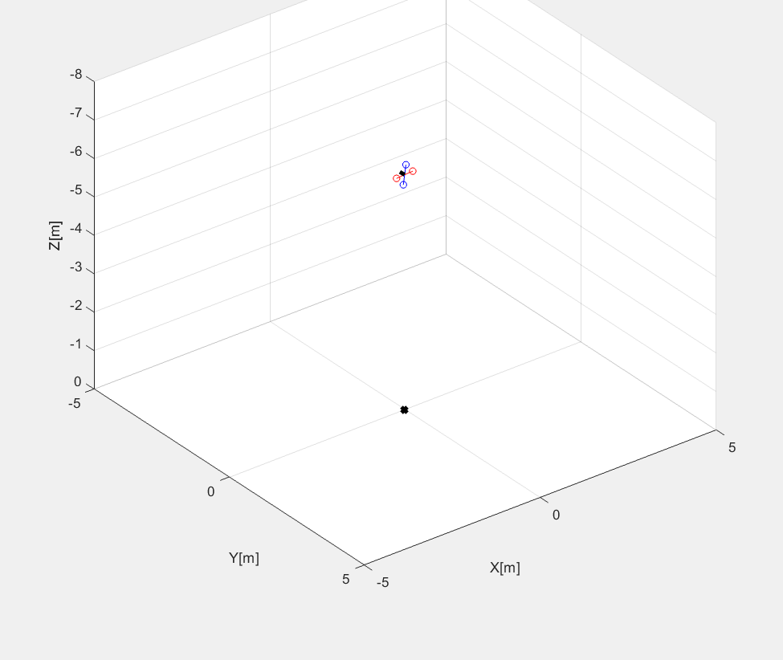
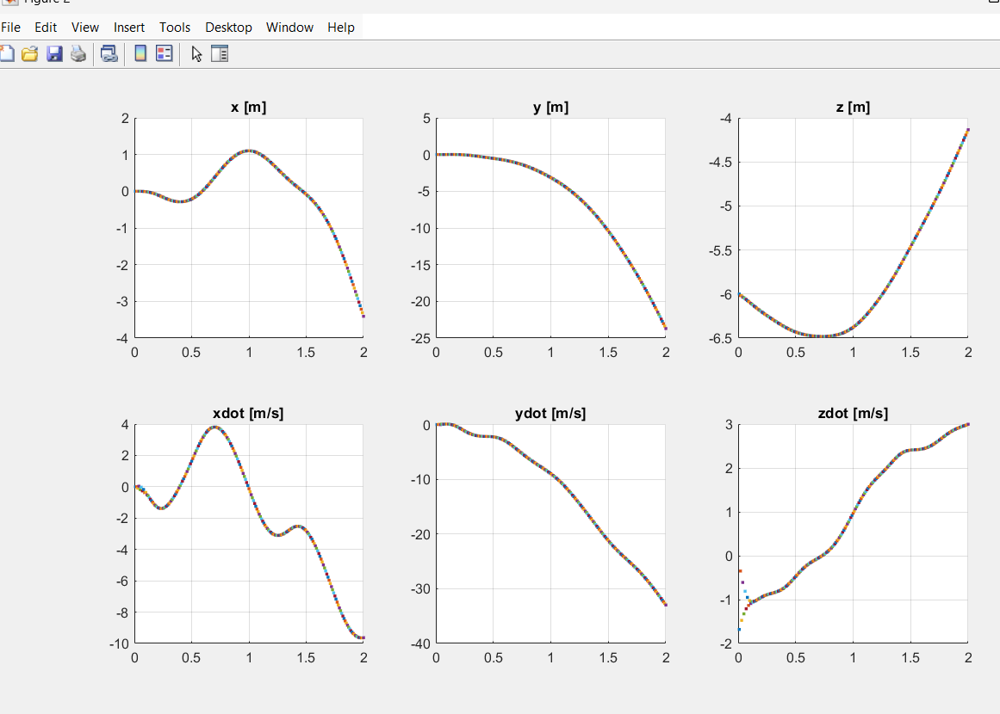
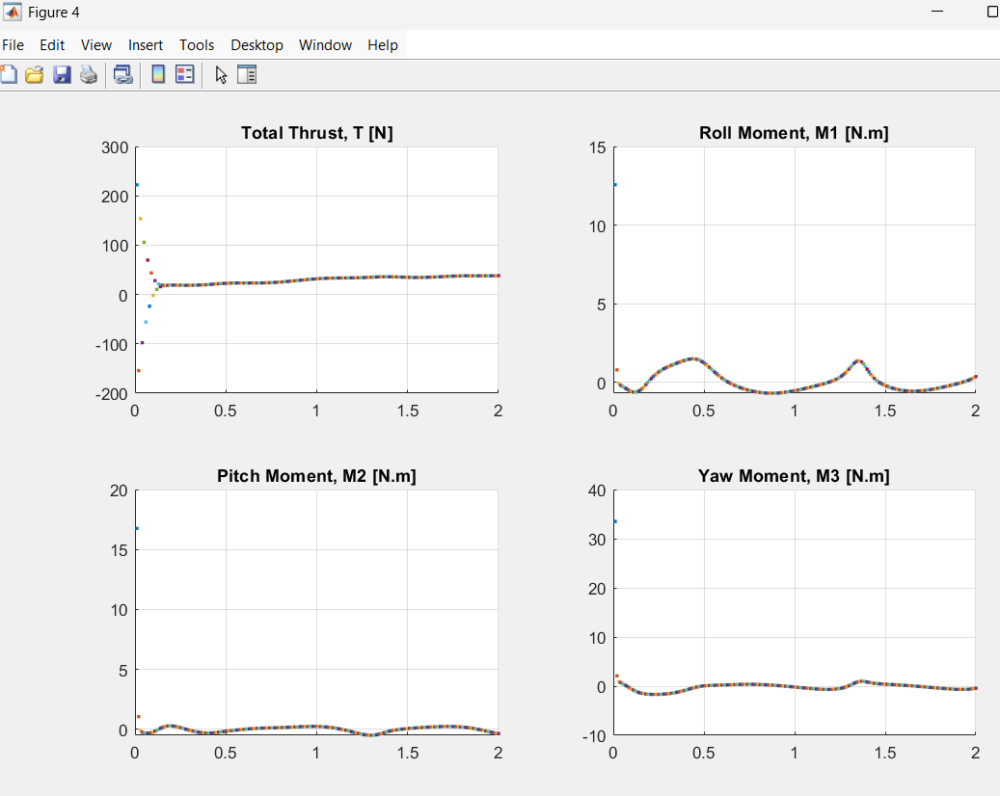
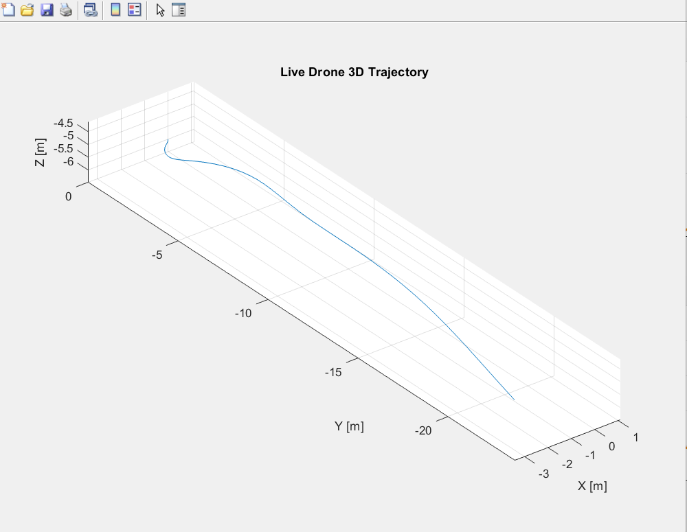

# Simulation Results

This folder contains representative outputs generated from the MATLAB quadcopter simulation.

## Figure 1 — 3D Drone Visualization

## Figure 2 — Position and Linear Velocity

## Figure 3 — Euler Angles and Angular Velocity

## Figure 4 — Thrust and Control Moments

## Figure 5 — Live 3D Trajectory

## Sample Simulation Dataset

A sample Excel dataset generated from the simulation is included in this folder.

* **File:** `sample_simulation.xlsx`
* Contains time history of the drone states and control inputs.
